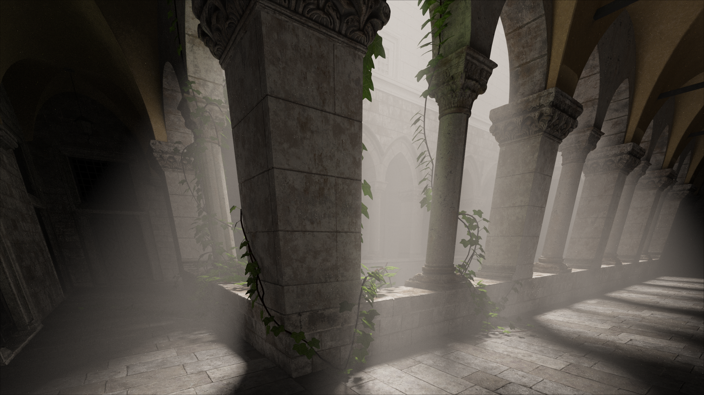

# Branch Descripting

This Branch works on rewriting the pathtracer in vulkan for faster perfomance and properly learning vulkan.

# Pathtracer Project

This project is a pathtracer, a type of renderer used to realistically simulate the behavior of light in a scene by tracing the paths of light rays.

## Showcase

